# Yuzuriha Rin Technical Reference

## 1. System Overview

Yuzuriha Rin is a full-stack virtual character chat experience that mimics WeChat UX. The runtime combines:

- **Frontend** (`src/frontend`): a static SPA (no build step) rendered via FastAPI’s static hosting. It uses vanilla ES modules, custom DOM utilities, and CSS to simulate a phone shell, session list, chat scrollback, toolbars, debug panes, and toast UX.
- **Backend** (`src/api`, `src/services`, `src/infrastructure`): FastAPI application with HTTP + WebSocket APIs, session-oriented WebSocket orchestration, SQLite persistence, and a domain service layer.
- **Behavior + LLM orchestration** (`src/services/behavior`, `src/services/llm`, `src/services/session`): a rule system that turns LLM replies into realistic typing/emotion/sticker timelines, with tool-calling support.
- **Data & ML assets** (`assets/models`, `scripts/ml_training`): intent datasets, notebooks, and fine-tuned `intent_predictor` weights that enable contextual sticker selection.
- **Operational tooling** (`tools/sticker_manager`): PyQt utility to curate sticker atlases and keep metadata in sync.

All runtime services are Python 3.10 compatible (`.python-version`) and rely on `uv` for dependency resolution (`pyproject.toml`).

---

## 2. Architecture Diagram

```mermaid
%%{init: {
  "theme": "base",
  "themeVariables": {
    "background": "#0b1020",
    "primaryColor": "#111827",
    "primaryTextColor": "#e5e7eb",
    "primaryBorderColor": "#475569",
    "lineColor": "#60a5fa",
    "clusterBkg": "#0f172a",
    "clusterBorder": "#334155",
    "tertiaryColor": "#0b1020",
    "fontFamily": "ui-sans-serif, system-ui, -apple-system, Segoe UI, Roboto"
  },
  "flowchart": {
    "curve": "linear",
    "diagramPadding": 24,
    "nodeSpacing": 55,
    "rankSpacing": 70
  }
}}%%

flowchart LR
  %% ---- styles (hard-coded dark) ----
  classDef subLabel fill:#0f172a,stroke:#0f172a,color:#94a3b8,font-size:12px;
  classDef box fill:#111827,stroke:#475569,stroke-width:1.2px,color:#e5e7eb;
  classDef hub fill:#0b1228,stroke:#94a3b8,stroke-width:1.5px,stroke-dasharray:5 4,color:#e5e7eb;

  %% ---------------- Client ----------------
  subgraph Client["Frontend"]
    direction TB
    ClientPath["src/frontend"]:::subLabel
    UI["UI<br/>(sessionList.js, chatView.js, styles.css)"]:::box
    State["State store<br/>(state.js)"]:::box
    Net["Network clients<br/>(api.js / ws.js / globalWs.js)"]:::hub
    UI --> Net
    State --> Net
  end

  %% ---------------- API ----------------
  subgraph API["FastAPI"]
    direction TB
    APIPath["src/api"]:::subLabel
    HTTPRoutes["REST<br/>(http_routes.py)"]:::box
    SessionWS["Session WS<br/>(websocket_session.py)"]:::box
    GlobalWS["Global WS<br/>(websocket_global.py)"]:::box
    APIFacade["API Facade<br/>route → service dispatch"]:::hub
    HTTPRoutes --> APIFacade
    SessionWS --> APIFacade
    GlobalWS --> APIFacade
  end

  %% ---------------- Services ----------------
  subgraph Services["Domain layer"]
    direction TB
    ServicesPath["src/services"]:::subLabel

    MsgSvc["MessageService"]:::box
    CharSvc["CharacterService"]:::box
    ConfigSvc["ConfigService"]:::box

    SessionSvc["SessionService<br/>Timeline + LLM + Tools"]:::box
    Behavior["BehaviorCoordinator<br/>+ modules"]:::box
    ToolSvc["ToolService"]:::box
    LLMSvc["LLMService<br/>(protocol-aware)"]:::box

    %% API → Services（减少交叉线）
    APIFacade --> MsgSvc
    APIFacade --> CharSvc
    APIFacade --> ConfigSvc
    APIFacade --> SessionSvc

    %% SessionSvc 内部编排
    SessionSvc --> MsgSvc
    SessionSvc --> CharSvc
    SessionSvc --> ConfigSvc
    SessionSvc --> Behavior
    SessionSvc --> LLMSvc
    SessionSvc --> ToolSvc
    ToolSvc --> MsgSvc
  end

  %% ---------------- Infra ----------------
  subgraph Infra["Infrastructure"]
    direction TB
    InfraPath["src/infrastructure"]:::subLabel
    WSMan["WebSocketManager"]:::box
    PortMgr["PortManager"]:::box
    Repos["Repositories"]:::hub
    DB["SQLite<br/>(rin_app.db)"]:::box
    Repos --> DB
  end

  %% ---------------- Assets ----------------
  subgraph Assets["ML Assets"]
    direction TB
    IntentModel["Intent predictor<br/>assets/models/intent_predictor"]:::box
    Datasets["few_shot_intent_sft<br/>+ notebooks"]:::box
  end

  %% ---------------- External ----------------
  LLMProvider["LLM Provider<br/>(via HTTP)"]:::box
  LLMSvc --> LLMProvider

  %% ---------------- Cross-subgraph wiring ----------------
  Net <--> HTTPRoutes
  Net <--> SessionWS
  Net <--> GlobalWS

  SessionWS --> WSMan
  GlobalWS --> WSMan

  MsgSvc --> Repos
  CharSvc --> Repos
  ConfigSvc --> Repos

  Behavior --> IntentModel

  %% ---- force subgraph (cluster) colors (non-transparent, hard-coded) ----
  style Client fill:#0f172a,stroke:#334155,stroke-width:1.5px
  style API fill:#0f172a,stroke:#334155,stroke-width:1.5px
  style Services fill:#0f172a,stroke:#334155,stroke-width:1.5px
  style Infra fill:#0f172a,stroke:#334155,stroke-width:1.5px
  style Assets fill:#0f172a,stroke:#334155,stroke-width:1.5px

  %% ---- links: high-contrast + thicker (also hard-coded) ----
  linkStyle default stroke:#60a5fa,stroke-width:2.6px

```

---

## 3. Three-Layer Architecture

| Layer | Responsibilities | Key Modules |
| --- | --- | --- |
| **Presentation** | Render WeChat UI, manage local state, orchestrate HTTP/WebSocket traffic, drive modals/settings, and show debug tools. | `src/frontend/index.html`, `scripts/app.js`, `scripts/core/*`, `scripts/views/*`, `styles/styles.css`. |
| **Application / Domain** | Encapsulate behavior logic (timeline, stickers, typos), LLM conversations, intent inference, tool calls, configuration/builtin seeding, logging, and WebSocket coordination. | `src/services/**/*`, `src/core/models/*`, `src/core/utils/logger.py`. |
| **Infrastructure** | Persistence (SQLite schema & repositories), networking helpers, runtime config. Provides the single source of truth that upper layers depend on through interfaces. | `src/infrastructure/database/*`, `src/infrastructure/network/*`, `src/core/configs`. |

The separation is enforced through repository interfaces (`src/core/interfaces/repositories.py`), service constructors, and FastAPI dependency injection (`src/api/dependencies.py`).

---

## 4. Data Structures & Single Sources of Truth

### 4.1 Domain Models

- **Character** (`src/core/models/character.py`): Stores persona, avatar, sticker packs, and nested `BehaviorConfig`. The model accepts legacy flattened fields (e.g. `timeline_hesitation_probability`) but normalizes them into `behavior.*` on validation. Its `model_dump()` adds flattened fields to keep HTTP/DB compatibility. _This class is the canonical source for all behavior defaults._
- **BehaviorConfig & Modules** (`src/core/models/behavior.py`): Define every knob (timeline delays, typo rates, sticker probabilities, pause windows). Services never hardcode defaults elsewhere.
- **Message** (`src/core/models/message.py`): Captures chat events (text, image, system, emotion, typing, tool hints) with typed metadata, recall/read flags, timestamps.
- **Session** (`src/core/models/session.py`): Binds a character to a conversation, with `is_active` flag for UI defaulting.
- **Schemas** (`src/core/schemas.py`): Provide `LLMConfig` and `ChatMessage` shapes for LLM orchestration.

### 4.2 Persistence Layout

SQLite is initialized by `DatabaseConnection._ensure_schema()` with tables:

- `messages`: holds the entire transcript (including system events). `idx_session_timestamp` ensures incremental pulls are fast.
- `characters`: contains character metadata plus every flattened behavior knob.
- `sessions`: tracks session records and the active session via unique constraint.
- `app_config`: generic key/value config store.
- `user_settings`: only user avatar data.

Repositories (`src/infrastructure/database/repositories/*.py`) implement CRUD and state changes. They are the only modules with SQL knowledge; higher layers call them through interfaces.

### 4.3 Configuration

- `.env`-backed Pydantic settings (`src/core/configs/settings.py`) cover app details, websocket defaults, LLM fallback values, UI colors, and DB path.
- Runtime config (`ConfigService`) merges DB overrides with `DEFAULT_CONFIG` (single source held in `src/services/configurations/config_service.py`). The front-end always receives a complete config object, so it can bootstrap without extra queries.

---

## 5. Backend Components

### 5.1 HTTP Routes (`src/api/http_routes.py`)

- **Characters**: CRUD endpoints with schema-backed payloads. Builtin characters (`builtin-rin`, `builtin-abai`) are protected against updates/deletes. When a character updates, the route notifies every active WebSocket session via `SessionService.update_character()` and emits toasts.
- **Sessions**: RESTful listing, activation, recreation. `/sessions/{id}/messages` exposes incremental sync via timestamp.
- **Config**: GET/POST for runtime settings with URL sanitization (`src/utils/url_utils.py`).
- **Avatar**: user avatar CRUD with strict validation (whitelisted static paths, data URLs, or HTTPS).
- **Sticker assets**: static file serving with path traversal protection.
- **Hash endpoint**: returns SHA derived from multiple tables to let the frontend detect divergence and run full sync.

### 5.2 WebSocket Hubs

- `/api/ws/{session_id}` (`websocket_session.py`): Maintains per-session connections in `WebSocketManager`, streams history on connect, routes events (send_message, recall, typing, init_character, mark_read, tool interactions). It also manages `SessionService` instances per session (`session_clients` dict), ensuring LLM pipelines stop on shutdown.
- `/api/ws-global` (`websocket_global.py`): Dedicated to operational tooling. Streams `unified_logger` logs to any debug subscribers, handles debug mode toggles, and shares the same `WebSocketManager` for broadcast.

### 5.3 Services

- **MessageService**: Enforces invariants (system sender vs. message type), inserts synthetic time markers for large gaps, manages typing/emotion/system events, recall logic, read receipts, and blocked-session behavior (sends hint when the remote refuses messages).
- **CharacterService**: Seeds builtin characters and sessions, ensures sticker packs contain required defaults, orchestrates active session switching and recreation (`recreate_session` deletes previous session + messages).
- **SessionService**: Orchestrates the chat pipeline.
  - Builds LLM history from DB while trimming system noise and rewriting the greeting block to a clean hint (`_build_llm_history`).
  - Calls `LLMService` (with protocol-specific payloads; currently only `completions`) and handles structured JSON output (reply + emotion map + tool calls).
  - Retries tool calls with a cap (`MAX_TOOL_CALL_ITERATIONS=5`), executes `ToolService` commands (avatar descriptions, recall, block user, etc.), and stores tool results as hidden `SYSTEM_TOOL` messages for auditing.
  - Converts replies into `BehaviorCoordinator` actions (segmentation, typos, recall sequences, sticker evaluation) and schedules them with `TimelineBuilder`, sending typing indicators and recall events in real time.
- **BehaviorCoordinator**: Wraps `SmartSegmenter`, `TypoInjector`, `PausePredictor`, `StickerSelector`, and `TimelineBuilder` to produce realistic multi-step action lists. It also logs sticker selection reasoning via `unified_logger`.
- **ToolService**: Interprets function-call payloads, manipulates `MessageService` (recalls, blocks), integrates `image_descriptions` metadata, and enforces rule-of-two-minute recall windows.
- **LLMService**: Normalizes `LLMConfig`, builds system prompts with persona and nicknames, dispatches to provider via `httpx` (supports future `responses`/`messages` protocols), enforces JSON outputs, logs both request/response, and reuses existing emotion state if the model returns none.
- **ConfigService**, **PortManager**, **WebSocketManager**, **UnifiedLogger** round out infrastructure concerns.

### 5.4 Caching

- FastAPI dependencies leverage `functools.lru_cache` (`src/api/dependencies.py`), so services/repositories reuse singleton DB connections and avoid churn.
- `UnifiedLogger` buffers the last 1 000 log entries for late subscribers.
- Frontend `state.messageCache` is the only client-side cache and is reconciled via hash + incremental HTTP fetches.
- `ImageDescriptions` caches JSON lookups in-memory for `ToolService` and `StickerWidget`.

---

## 6. Frontend Architecture

### 6.1 Boot Flow

1. `createApp().init()` loads persisted state (`state.js`), fetches `/api/hash`, and runs a **full sync** (characters, sessions, config, avatar) when the local hash and server hash differ.
2. All characters/sessions hydrate `state`, then the app attempts incremental message sync per session (HTTP pull) before establishing WebSockets.
3. Global websocket is established for logs/toasts, and per-session clients (`WsClient`) are created for every known session. Active session state is mirrored in `session_clients` server-side, so UI toggles automatically reinitialize behavior services.

### 6.2 State & Views

- **State store** (`state.js`): Map-based store persisted in `localStorage`. It includes message caches, read timestamps, config, characters, sessions, and avatar. `upsertMessages()` marks recalled messages and deduplicates by ID.
- **Session list** (`views/sessionList.js`): Sorts sessions by latest effective timestamp, renders unread badges (assistant-only unseen messages), and toggles UI to session view when a session is selected.
- **Chat view** (`views/chatView.js`): 
  - Maintains a `messageContainersBySession` map to avoid re-rendering the entire DOM when switching sessions.
  - Displays typing indicators, read receipts, blocked markers, recall hints, and image previews with `medium-zoom`.
  - Implements smooth scroll-to-bottom, "new message" floating indicator, and read-tracking by DOM position.
  - Applies emotion themes via CSS `--emotion-gradient-*` variables when emotion metadata is present and `enable_emotion_theme` is enabled.

### 6.3 Data Synchronization

- **REST**: Used for initial data, incremental message sync (pagination by timestamp), config updates, and avatar uploads.
- **Session WebSocket**: Streams history on connection, publishes message events, read-state, session recreation events, and error toasts. It is also the control plane for sending messages, clearing sessions, marking read, switching active sessions, and calling `init_character`.
- **Global WebSocket**: Streams `unified_logger` entries to the optional debug pane and broadcasts toast directives (e.g., what happens when the backend warns about missing API keys).
- **Conflict Resolution**: The frontend’s `state.lastServerHash` ensures a single source of truth—the backend. Any hash mismatch triggers a full re-sync. Message caches are pruned/merged purely based on server timestamps and recall markers.

---

## 7. Intent Predictor & ML Pipeline

### 7.1 Datasets

- Stored under `assets/models/few_shot_intent_sft`. The directory contains:
  - `few_shot_intent_sft.py`: a Hugging Face–compatible dataset builder that combines dozens of intent datasets into templated few-shot prompts (handles random n-way/n-shot selection, descriptive labels, and prompt templates).
  - `data/*.jsonl` + `*_template.txt`: raw corpora and prompt templates per source (ATIS, SMP2017/2019, banking77, telemarketing, etc.).
  - `examples/preprocess` scripts: dataset-specific processors that normalize original sources into the JSONL format the builder expects.
  - `README.md`: dataset catalog, sample prompts, and data provenance.

### 7.2 Training Workflows

- `scripts/ml_training/01_intent_data_analysis.ipynb`: 
  - Loads corpora, filters noise, balances labels, and produces reports (CSV, parquet) saved under `assets/models/intent_predictor`.
  - Generates summary plots for notebooks (label distributions, length stats).
- `scripts/ml_training/02_intent_model_training.ipynb`:
  - Fine-tunes `hfl/chinese-bert-wwm-ext` with the cleaned dataset, logs confusion matrices and F1 scores, and saves `model.safetensors`, tokenizer files, metrics, and `intent_mapping.json`.
  - Snapshots the entire `assets/models/intent_predictor` directory into `assets/models/intent_predictor_backups/<timestamp>` before overwriting.

### 7.3 Runtime Usage

- `StickerSelector` uses `IntentPredictor` to map LLM-generated text to sticker categories. It loads weights lazily from `assets/models/intent_predictor` (or falls back to keyword heuristics if missing).
- Training metadata (`intent_mapping.json`) defines `id2intent` so runtime predictions can be converted into the standardized romaji codes expected by `StickerSelector.INTENT_ROMAJI_MAP`.

---

## 8. Data Interaction & CRUD Ownership

| Entity | Create | Read | Update | Delete |
| --- | --- | --- | --- | --- |
| **Character** | `CharacterService.create_character()` → `CharacterRepository.create()` | `CharacterService.get_character(s)` | `CharacterService.update_character()` (non-builtin) | `CharacterService.delete_character()` (non-builtin) |
| **Session** | `CharacterService.initialize_builtin_characters()` / `create_character()` | `SessionRepository.get_*` | `SessionRepository.set_active_session()` | `SessionRepository.delete()` via `recreate_session()` or character deletion |
| **Message** | `MessageService.send_message_with_time()` / behavior timeline playback | `MessageRepository.get_by_session()` (HTTP + SessionService) | `MessageRepository.update_recalled_status` / `mark_read_until` | `MessageRepository.delete_by_session()` |
| **Config** | `ConfigService.set_config_batch()` | `ConfigService.get_*` | same | `ConfigRepository.delete()` (user avatar removal, config delete) |
| **User Avatar** | `ConfigRepository.set_user_avatar()` | `ConfigRepository.get_user_avatar()` | same | `ConfigRepository.delete_user_avatar()` |

All mutations flow through services that enforce invariants (e.g., builtin protection, recall windows, blocked-state hints). There are no raw SQL calls in routes.

---

## 9. SOLID Principle Highlights

1. **Single Responsibility**: Each service tackles a distinct concern (MessageService handles messaging invariants, BehaviorCoordinator orchestrates behavior modules, ToolService handles tool calls). Domain models (Character, BehaviorConfig) are pure data + validation.
2. **Open/Closed**: Behavior modules can be extended by adding new configs without modifying TimelineBuilder logic because defaults live in the dataclasses. FastAPI routers rely on dependency injection, so new endpoints just plug into services.
3. **Liskov Substitution**: Repository interfaces define the contract; the SQLite implementations honor them. If a different persistence backend is needed, a replacement class can satisfy the interface without breaking services.
4. **Interface Segregation**: Each repository interface focuses on a single aggregate root, so services only depend on the methods they need (e.g., MessageService never sees character-related methods).
5. **Dependency Inversion**: High-level modules (`CharacterService`, `SessionService`) depend on abstractions (`ICharacterRepository`, `IMessageRepository`), not concrete DB classes. FastAPI dependency wiring provides the actual implementations.

---

## 10. Data Synchronization, Transport & Caching

- **Transport**: All HTTP endpoints return JSON. WebSockets use JSON envelopes (`{"type": "...", "data": ...}`) so the frontend can dispatch generically.
- **Sync Strategy**:
  - Hash endpoint ensures state drift detection.
  - Incremental syncing uses `after` query param and server-side timestamp index; the frontend doesn’t rely solely on WebSockets to backfill missed events.
  - WebSocket `session_recreated` events instruct the UI to drop caches, recreate containers, and rebind to new session IDs.
- **Cache Invalidation**:
  - When config changes succeed, the backend toasts warnings (e.g., missing API key) and SessionService reinitializes the conversation state with fresh LLM config.
  - When characters change, `http_routes.update_character` iterates active `SessionService` instances and calls `update_character()` so in-memory behavior settings match DB truth. A toast informs the user.

---

## 11. Observability & Safety

- **Unified logging** (`src/core/utils/logger.py`): Normalizes log levels/categories, stores buffered entries for the debug pane, and fan-outs to global WebSocket if debug mode is on.
- **Tilt-proof WebSocket manager**: Filters non-existent sessions, isolates user-scoped broadcasts when blocked, and ensures cleanup on shutdown via `cleanup_resources()` (closes all WS connections and stops SessionService workers).
- **Validation**: Pydantic models (FastAPI request bodies, Character model validators), sanitized avatars, sanitized LLM base URLs, and `MessageService._ensure_system_invariants()` to prevent forged system messages.
- **Tool controls**: Hard limit on tool-call loops, deduplicated tool results, guardrails for recall (`<=120s`) and block actions (auto hint).
- **Sticker governance**: `tools/sticker_manager` enforces that each sticker pack contains exactly 70 canonical categories, auto-creates missing directories, flags unknown ones, and writes all metadata to `assets/configs/image_descriptions.json`.